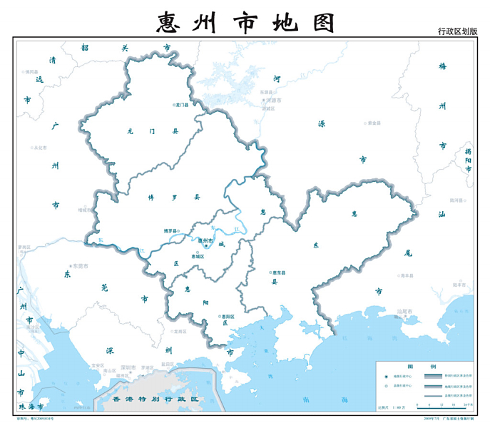
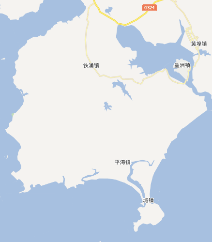
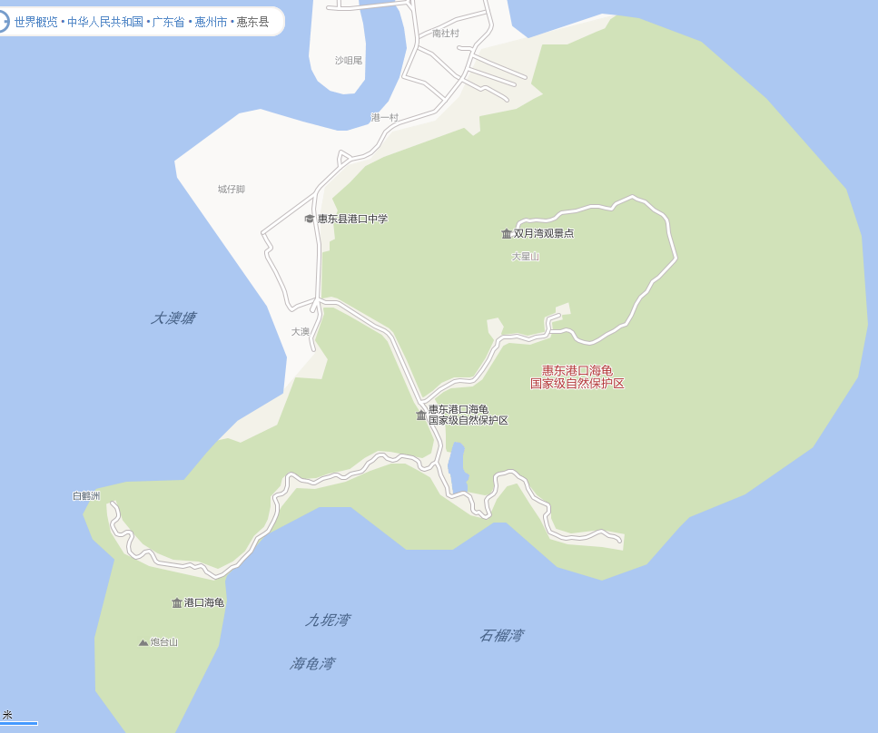
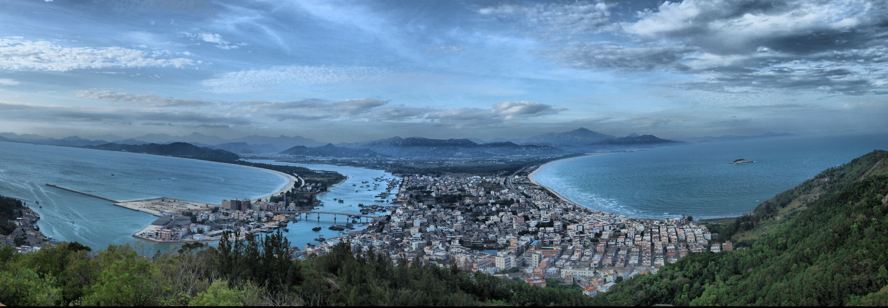
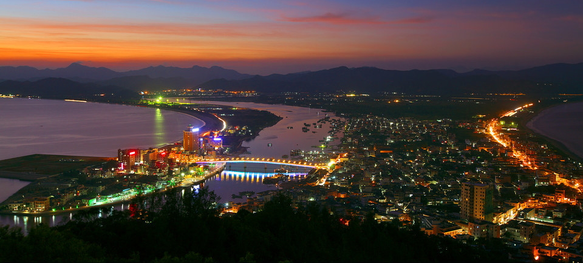
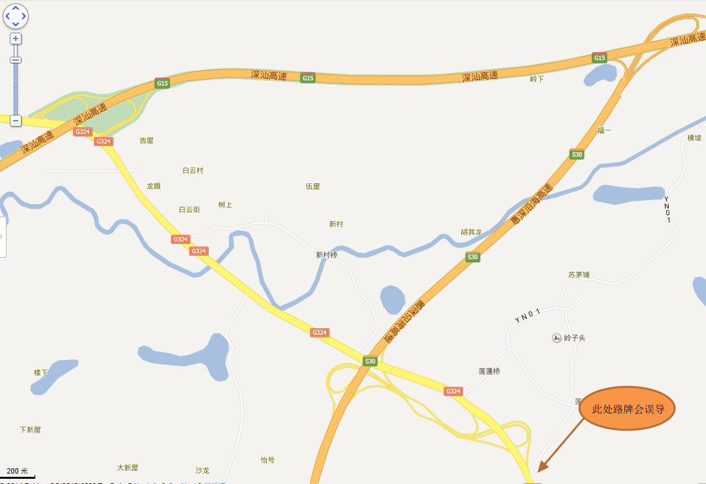

## 目的地

双月湾位于：惠州市--惠东县--港口镇

### 惠州市

惠州，面积 11200km2，是深圳（2000km2）的 5.6 倍，东莞（2500km2）的 4.5 倍。

惠州，我觉得像一只前踢跃起的兔子：

- 头顶：韶关
- 眼观：清远
- 嘴亲：广州
- 手抓：东莞
- 猥琐：深圳
- 身背：河源
- 臀下：汕尾

惠州有 2 个区，3 个县，把惠州横切了 4 刀：

- 兔头-龙门县：南昆山、铁泉
- 前腿-博罗县：罗浮山、观音阁
- 粗腰-惠城区：西湖
- 腹部-惠阳区：楼盘
- 臀尾-惠东县：巽寮湾、双月湾

景点去过的不多，能列就这么几个。

### 惠东县

惠东县大部分是内陆，但最南边伸出的一个半岛，被**范和港**和**考洲洋**夹出细细的脖子，好像一个离岛似的，为：**稔平半岛**（稔山和平海）。

稔平半岛和深圳的大鹏半岛隔海相望，离得并不远，如果去桔钓沙玩，会有一个坐船 20 分钟就到大甲岛、小甲岛露营的节目，大/小甲岛全称是大/小辣甲岛，已经属于惠州，位于深圳和惠州海域的中间，可以推算，坐快艇的话，从大鹏半岛到稔平半岛也就 40 分钟了。

岛上有 3 个镇：

1. 铁涌镇：巽寮湾在其西边海岸
2. 平海镇：平海古城也是惠州知名景点之一
3. 港口镇：惠东县的官网上只有铁涌和平海，但当地人和百度地图都表示：这里是“港口镇”

稔平半岛内目前没有高速，甚至连省道（S324）也是在门口掠过而已。下了省道，都是没有黄、白线的田间公路，镇上还是九十年代影片中的吵杂和纷乱景象，甚至红绿灯都不亮的，走在这样的街道上，看到美丽的山峦、蒸腾的雾霭、或喜欢的水果，随便停下……这才是生活嘛。

**惠东双湾**：

1. 巽寮湾：位于上图“港口列岛”海域，开发的较早，比较成熟，意味着人多、景色和魅力已非原生态。
2. 双月湾：位于上图“平海湾”海域，目前刚开始开发，预计 3 年后原始、美丽的双月湾将不复存在，要去趁早。

遥想 9 年前刚到深圳时干净的大小梅沙，再看这几年的垃圾如山和人多如麻的大小梅沙，桔钓沙、杨梅坑通通不能幸免，深圳人 10 年毁掉一个半岛的速度正在向惠阳和惠东渗透。

透过开发商们制作的图，能看到他们的野心，和不给子孙留一处干净之处的决心：

### 港口镇

港口镇居民讲福佬话，镇上一半都是华侨和港澳台胞。

从外形上看，港口镇像个伸出大拇指的拳头，有人说港口镇是因双月湾而闻名，也有人说港口镇哪里只有双月湾，确实，她的景点还真不少。

1. 双月湾：在手腕处，内海隔开了尺骨和桡骨
2. 大星山：手心，双月湾全景观景台
3. 炮台山：大拇指
4. 海龟基地：食指
5. 最美私人沙滩：虎口处

漫步在镇上，遇到比较多的地名还有：

1. 港口大桥：内海上的一座桥，其实是个只能并排走两辆车的小桥
2. 沙尾咀：西湾最下面
3. 蔡家村：有个公园
4. 港口中学：比较好导航的一个地方

### 双月湾

双月湾的地形是**双湾夹内海**：

1. **东湾**：当地人称为**右湾**，波涛汹涌，无法游泳、没有娱乐设施。
2. **西湾**：当地人称为**左湾**，风平浪静，已经开发，当地人又称为“景区”。
3. **内海**：内海中停放着众多的渔船，西岸边是宾馆林立，东岸边是海鲜市场，一派渔村景象。

双月湾的夜景也非常美丽，从灯光中你可以看到哪里是村落，哪里是道路。

## 路线

深圳过去有两条路：

1. 南坪快速--水官高速（布龙--荷坳，12 元）--G25/G15（荷坳--稔山，42 元）
   - 路比较直，没什么景色，其中 S25 有一段还是单向两车道的老高速。
   - 全程限速 100
2. 北环--罗沙--东部沿海/深盐二通道--[S30\_惠深沿海高速](https://baike.baidu.com/item/惠深沿海高速公路/964023?fr=aladdin)（从头走到尾，43 元）
   - 东部沿海高速/深盐二通道：免费，罗湖到盐田
     - 只有 11km 左右，直接与 S30 的盐坝对接
     - 盐田界内在原来的深盐路上做高架，所以叫“深盐二通道”
   - S30 惠深沿海高速：盐田站--稔山，43 元
     - 深圳段：原盐坝高速，限速 80，看新闻这个月正在讨论盐坝和龙大的取消收费，但愿早日取消吧，这样去双月湾至少省 15，哈哈
     - 惠州段：听说 2003 年原本计划建设的也是免费的一级公路，后来改成了收费的高速公路，但可恶的是，还是限速 100（网页上说限速 80，但路上现在是 100）
     - 路面非常宽广，沿海而建，景色优美，只不过限速 80、100，实在蛋疼的要命。
     - S30 走到头刚好到稔山，简直就是为稔平半岛量身定制的，类似于上次去从化，[S29（从莞深高速）](http://zh.wikipedia.org/wiki/%E4%BB%8E%E8%8E%9E%E6%B7%B1%E9%AB%98%E9%80%9F%E5%85%AC%E8%B7%AF)简直就是为从化量身定制一样，走到头刚好到从化温泉镇。交通发达了，从深圳出发，不下高速能去的地方更多了。

两条线路的比较：

- 高速上耗时都差不多，1.5h。
- 深圳市内路段有差别：走南坪快速、和走北环-布心-罗沙还是差别挺大的。
- 惠东县内是一样的：下高速后走省道 S324 和县道要 1h，但景色美丽，沿途还有水果。

从双月湾回深圳时，会依次路过“惠深沿海高速入口”和“G15 入口”，但在路过第一个入口的时候，路牌显示的是：

- 直行：惠州 —— 应该优化为：G15（深圳）、惠州
- 右行：深圳 —— 应该优化为：S30（深圳）

否则，大部分人都按着路牌走 S30 去了。走 S30 也不是不好，只不过周日回程路过大梅沙路段，可能会堵。

## 游记（2014.6.21-6.22）

几周前，从老大那里才听到的“双月湾”这个名字，本不怎么在意，自己在广东也呆了快 10 年了，清远、韶关、大小景点也算游历了不少，并且每次都是功课做足（就跟上文似得），怎么没听过这个双月湾呢？还在巽寮湾旁边？心想定是个偏远、不起眼的小地方。微博上搜了一下，也寥寥数个，不过是万科的一个楼盘、民宿也只能搜到两个，随后便放下了。

几天前，解放了的 S 要潇洒一把，同桌的 Z 是爱玩之人，即刻响应，3 家、5 人了，去哪里呢？就又想起双月湾，说走就走。

### 上天帮助有冒险精神的人

找人，是第一步，问了几个，婉拒的理由无非是：

- “周末有大雨嘞” —— 潜台词是这个风险我不冒。有雨是真的，整个广东都正笼罩在阴雨中。
- “太热了”、“太晒了” —— 这是根本没兴趣，随便找理由拒绝的人，因为天气都没问。
- “两天啊？” —— 周末活动、充电、孩子学习……一堆事啊，周末比上班还忙的人。
- “都有谁去啊？” —— 笃信“旅行不在于风景有多美，而在于跟谁一起看”的人。

最后，S 连朋友圈上都发广告了，也没招募到。去球，我们 3 家够了。大雨算啥，我们的信条是：**旅行，就要有冒险家精神**。

周五晚，看着天天向上，听着外面哗哗的大雨，心中的焦虑不能说没有，要不怎么一直看到爸爸去哪儿都演完了才去睡。

周六早 8 点，两辆车在雨中出发了。

雨中开高速的经历不多，还是小心为上，一路速度都没上 100，雨刷夸夸的刮来刮去，车里连音乐都没放。

2h 的高速路一直在雨中，终于到了稔山收费站，一出收费站，雨停了，南边稔平半岛的天空也是蓝色的，这种心情就像赢了一场赌注。

下了高速就是省道 S324，沿途经过**范和村**，号称广东最美村庄，旁边就是范和港。车子在农田中穿梭，远处是雨后烟雾缭绕的群山。

没过多久，就到了一个叉路口，路牌上大字写着：往右（西边）是巽寮湾，往左（东边）没写啥，其实就是双月湾了。

### 夏季是广东的水果季

乡间小路上大概走了 1h，沿途不时见到荔枝、火龙果的卖摊儿，6 月，正是吃荔枝和火龙果的季节，桂味快下市了，糯米糍刚上市，这里的桂味有两种，普通桂味核比较大，还有一种小核桂味，甚至比糯米糍的核还小。但糯米糍的魅力不光在于核小肉多，还在于剥着方便，皮不扎手，沿着果实顶部的一条线，双指一捏，线就破开了。捏的力气大了，喷出来的汁还会溅到脸上。

龙眼真的是刚刚上市，广东的学生朋友们都有“放了暑假吃龙眼”的常识，因为刚上市，还有点小贵，10 元/斤，和糯米糍一个价。桂味是 6 块/斤。

“老板，糯米糍便宜点吧，我称 10 斤……”，10 斤应该够 6 个人吃两天了吧。

车里立刻洋溢着吃货的笑声，“给爸爸喂一个”妈妈下了命令，小家伙塞我嘴里一个，好甜啊。

### 住在海边但又听不到海浪

平海大桥，GPS 导航的终点站，终于到了，是个只能并排走两辆小车的桥，估计这名字是 20 年前起的吧。过桥之后就没啥岔路了，一条路走到港口镇的城镇上。

“海晴度假屋”是微博上能搜到不多的民宿之一，除此之外还有木木，其实开车沿途类似的民宿很多，只不过微博和百度上搜不到，和携程、柠檬合作的也多是宾馆，而不是民宿。

和海晴的主人周五晚通电话，海晴已经有人定了，你们定的太晚了，可帮忙介绍另一家，不临海但很近的民宿，不在景区，但就在海边，绝对不另你失望。—— 安排房子是组织者的头等大事，睡好了才能玩好，为了这个民宿到底能否让大家满意？有没有壮阔的海景？有没有安静的夜晚？这些矛盾的需求和电话里不能确定的答复，从昨晚一直折腾我到现在。

碰头之后，跟着他进了大澳村，来到一栋民宿前，屋前的龙眼挂满树枝，站在 3 楼，从前面楼的缝隙中可以看到大海，前行 30 米，是以前的码头--没有游人的海岸。这里是第 3 排房子，听不到海浪。太好了，晚上能睡个安静的觉了。

### 最晚的日落

今天是 6.21，夏至，太阳直射北回归线，惠州北纬 23 度，位于北回归线上，今天中午我们在太阳下如果笔直的站着，是没有影子的。太阳在每个人的正头顶，就像是保护我们的神祗的光环。

内海上有个浮船搭起来的海鲜大排档，濑尿虾有膏的 65，没膏的 25，鱿鱼 45，吃完了转身不过 100 米就上了西湾沙滩。

西湾沙滩号称 10 公里，确实很长，但有没有 10km 我看悬。沙子是黑沙，比黄沙细腻。由于天气预报的帮忙，沙滩上人不多，南半边的三三两两，北半边远处的沙滩基本没人。

我们原定的行程是先去爬山看全景，但既然走到这了，就先这吧，才下午两点多，比较晒，租了个帐篷撑起来，嗯，好多了。

玩吧：游泳、挖泥巴、埋人……无聊的玩法有着无尽的乐趣，或者说，越是无聊的玩法大家越喜欢，矜持的代价就是索然无味。

4h 真是快，转眼太阳西斜。**东湾看日出，西湾看日落**。日落前是最佳的拍照时间，仅仅有半个小时的。相机纷纷出马：夕阳、余晖、剪影、逆光……手机都能拍出单反的效果，难道我的单反白买了？

夏至，也是北半球白天最长的一天，就是说：我们站在双月湾沙滩上等待的是**最晚的日落**，享受着比其他时间来西湾看日落的人多出的几分钟、或者几秒钟：滴答、滴答、滴答……

### 寂静夜晚的麻将声

路过一家 22 年老店，解决了晚餐，比午餐便宜了一半，呵呵。

回到住处，主人都快要睡觉了，听到我们回来，过来招呼。见我们拿出了麻将，立刻搬来了麻将桌。

主人家是个 3 层的小楼，第 1 层自己住，第 2 层给儿子和儿媳住，第 3 层外租。主人姓崔，52 了，看起来刚过 40，我称呼大姐，后来才发现她儿子都 30 多了，孙子今年 3 月份出生，我该叫阿姨才对啊。还是大姐吧，人家确实显得年轻。

崔姐平常肯定是早早休息的，穿着睡衣招呼了我们一会儿就睡觉去了，儿子儿媳好像也去娘家去了，难道是为了躲我们？真不好意思啊。

我们这群深圳的夜猫子洗漱、切瓜、开啤酒、把麻将桌搬到阳台，呼呼啦啦就开搓了。海边很凉爽，阳台上微风习习，四周都已经熄灯了，想必大澳村是个对外出租民宿很少的村子。

上半场手气不好，光当陪练了，下半场桌子搬屋里，忽然转运了，自摸好几把。咱不像某些人，屁胡也胡，咱非自摸不胡 :D

### 门不用关，走就是了

周日的早上 7 点，我就醒了，掀开窗帘，下着小雨，微微有些惆怅。没关系，上天帮助有冒险精神的人，出去溜达溜达。

出门前行 30 米，到海边，清晨的海浪拍打着岸边，有一个穿着朴素的老乡在补渔网。海边第一排的屋子每家都有一串水泥阶梯伸向海边，我们对面按理说应该就是大鹏半岛，相隔 30 公里，肉眼是看不到了。

站了一会，不是文人骚客，也不是文艺青年，对着这海面、海浪、和海风也发不出啥感慨。录了一段海浪拍打岸边的视频后，就转身回了。

回到崔姐家，大姐正在做早饭，站在旁边聊聊天。

> 村子里有五百户左右，以前靠打渔为生，现在多是些老年人，年轻人一半都已经定居了香港，逢年过节才回来，平时没什么年轻人，游客也很少走到这里的，比较安静。村里有个妈祖庙，路径偏僻，灵验，还有无敌海景，如果想去可以带我们去。那边还有个私人沙滩。如果想去海龟湾还能熟人带我们半价进去…………

我爸文化不高，但有个本事就是能和各种人、各地人聊天，一起出去旅游，我用手机找的景点之外，我爸都能找到更好玩、更隐蔽的。和当地人多聊天，不要指望网络、百度、手机、大众点评能发现一切！ —— 我在向我爸学习。

吃完崔姐给我们做的早饭：肉丝鱼饼粉，我们去了妈祖庙，真是无敌海景啊，广阔而高远。崔姐站在妈祖庙前也不由得说，常常到这里看看，心情都好很多，每次有烦心的事，拜拜妈祖，看看海景，就都过去了。

崔姐要去喝早茶，儿子儿媳又都不在，崔姐撂下一句话就走了：我去找阿姐喝早茶，你们想几点钟走都行，门不用关，走就是了。—— 房子就交给我们 6 大 1 小陌生人了，是我们几个天生长的一副好人脸么？

### 东湾归来不看滩

看来昨天玩累了，海龟基地和爬山看全景的计划无人响应，算了，谁叫我们是“爱咋咋地散游团”呢，反正爬上去看到的和人家拍的照片也差不到哪里去，定是不会有什么大的新奇，罢了也就罢了。

私人沙滩不远，开车 3 分钟，过去瞄一眼吧。

哟！这里是黄沙，不是黑沙，黄沙粗，磨脚，没一会大家没了兴致。只剩下 6 岁的女儿孜孜不倦的捡贝壳，舍不得走。

12 点，结束旅程，启程回家。—— 本以为所有的惊喜都已经游历，哪知最大的彩蛋还在后面。

我来领路，思考着来时是沿着右湾走的，两边灌木丛生，没啥风景，回时不妨沿着左湾走，再瞅一眼左湾的沙滩和欢乐的人群。但没开导航，错过了拐上港口大桥的路口，竟又沿着右湾路走了上去。

右湾啥样子？从哪里拐进去？边走边想，灌木丛很长，沿着路边一直蔓延，但有多宽不知道。

唉？有个路口。停车！过去瞅瞅。一条小路穿过灌木丛，大概十几米宽，然后眼前跃出最最令人陶醉的一幕。

广阔的海面，悠长的沙滩，只有 3、5 个渔民站在百米外的浅滩中劳作。
细腻的黑沙坡度很小，一拨接一拨的海浪得以前后宽泛的冲刷，水涨、清澈的浪头不携带沙子，水落、浸润的沙面如镜面一般。
海浪从很远处而来，一层层前仆后继，渔民在浪中时隐时现。
小螃蟹不时钻出钻入，捡到的贝壳也总有活的……

言语已无法表达，照片亦无法记载。

阴天、无雨、不晒，感谢上天、和我们的冒险家精神，我们可以在这个沙滩上肆意奔跑、忘却时间。
