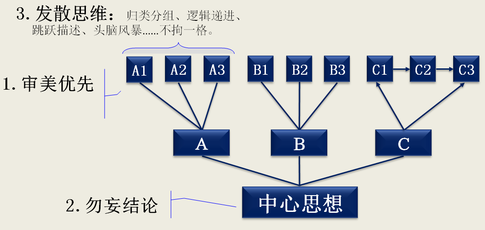

如果在电梯里遇到领导，问你某某项目进展如何，你给来了一段相声，估计你就二了。
如果看福尔摩斯，一开头就猜到了凶手，那就是柯南道尔失败了。
如果读一篇荷塘月色，非要总结出个大革命下的白色恐怖，那就是要洗洗脑了。
不同的文章，要用不同写作手法。

|                                 结果导向模型                                 |                           问题发现模型                            |                        平铺直叙模型                         |
| :--------------------------------------------------------------------------: | :---------------------------------------------------------------: | :---------------------------------------------------------: |
|                                                           |                                                |                                          |
|                                **金字塔原理**                                |                           **陀螺原理**                            |                        **柱子原理**                         |
|                                 **工作文档**                                 |                           **文学作品**                            |                       **记录、卷宗**                        |
| 工作汇报 工作邮件 学习总结 述职报告 新闻报道 论文 …… | 小说散文 影视剧本 个人书信 评书相声 颁奖词 …… | 案件卷宗 字典 纪录片 回忆录 实验记录 …… |

## 金字塔原理

- 四项基本原则 —— 思维架构化
  1. 结论先行
  2. 以上统下
  3. 归类分组
  4. 逻辑递进
- 三个子结构
  1. 序言 —— 读者和作者能站在同一水平线上，引入主题
  2. 纵向结构 —— 关注读者的疑问
  3. 横向结构 —— 逻辑关系
- 几个注意点：
  - 中心思想要诀：TOPS 原则
  - 不要存在“缺乏思想”的句子或句子内容空洞
  - 同一组句子不要超过 7 条
  - MECE —— “无交叉，无空白”

## 陀螺原理

- 三项基本原则
  1. **审美优先**：使用各种写作手法吸引读者读完全文，讲求引人入胜，读后绕梁三日、回味无穷
  2. **勿妄结论**：作者主要负责陈述事实，黑与白、对与错留给读者去判断，不可妄下结论，误导读者
  3. **发散思维**：归类分组、逻辑递进、跳跃描述、头脑风暴……不拘一格，但整体又都是为最终的核心思想服务。

## 柱子原理

- 三项基本原则
  1. **全面优先**：讲求全面、事无巨细的记录为目的，作者不要有倾向性的学术或政治立场
  2. **结论留白**：在没有得到结果或结论前，不做任何倾向性假设
  3. **平铺直叙**：流水账在有些场景是非常重要和必要的

### 最后

- 就使用场景来说，金字塔无疑是使用面最窄的，柱子其次，陀螺最广泛。
- 但不同的人使用频率不同，一个每天坐办公室的白领，金字塔的使用频率也许是最高的；一位艺术家，肯定每天都在思考怎么用陀螺钻的更深，甚至对金字塔嗤之以鼻。 —— 哪种角色决定了其使用频率，频率高的话还是要好好学习掌握相应的原则为好。
- 有人说，金字塔有啥神奇的，归纳、演绎……早就有之，芭芭拉不过总结一下而已，但是，就像学英语语法，一些很基本的语法学了很多年，很多人还是没掌握，因为虽然知道，但没有着意练习，就不会自然运用，所以还是需要不断有人敲打、提醒、纠正
- 无招胜有招，练成下面这样也许才是最高境界：

| 吸星大法            | 葵花宝典            |
| ------------------- | ------------------- |
|  |  |
