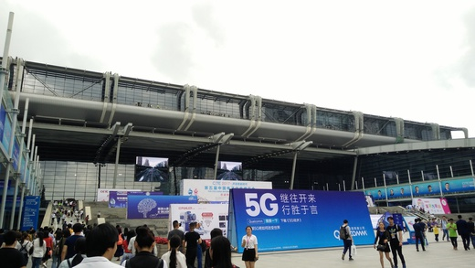
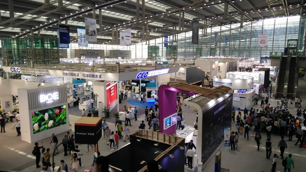
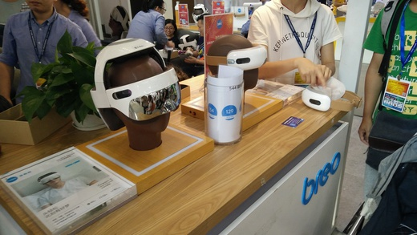
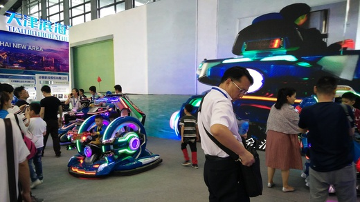
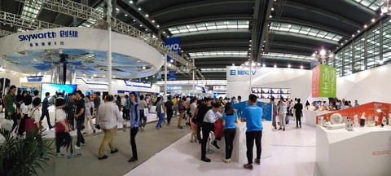
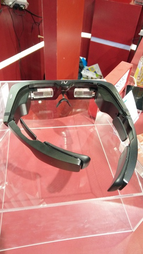
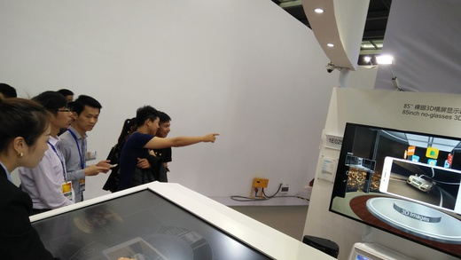
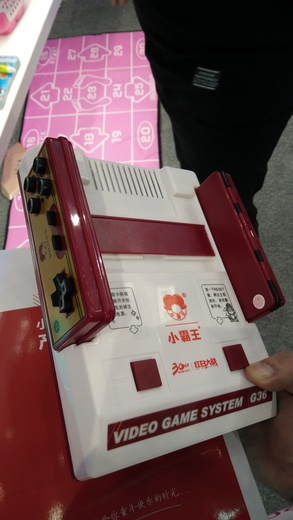
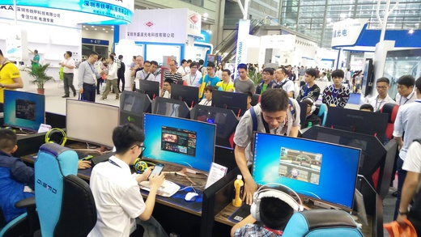
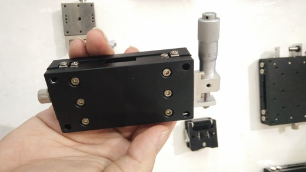

中国电子信息博览会，China Information Technology Expo，先多看几眼这个名字，电子信息这个称呼仿佛一下回到了 N 年前，以前很多学校还有电子信息专业，尤其是几个电子科大，但这个专业显得有些面太大、太笼统，跟我学的物理似得，学完好像啥都能干，又啥都不精。当下几年讲的多的是工匠精神，追去的是在某一领域钻研，所以自动化展、光博会、工业 4.0 展……让人望文生义。相比之下，电子信息博览会名字就笼统一下。

为什么会有这样一个命名的展会，告诉你一个我发现的原因，工信部下属的 24 个司局级单位，其中有个叫做电子信息司。工信部下还有信息通信发展司，所以你会看到[“中国国际信息通信展览会”](http://ptexpo.com.cn)，今年的日期是 9.27-30，北京国家会议中心。—— 嘿嘿，就这样喽。

闲话少说，开始说今天的 CITE 吧。

CITE 是个很年轻的展会，今年才第五届，所以即使令你有些失望，也不要沮丧，人家正在成长。

我是吃了中午饭才过去的，估计到会看的很快，所以没有一大早过去，并且很明智的带了女儿一起去，这就是事先做功课的好处，呵呵，为啥这么说，后面接着看。

深圳会展中心，还是老模样，一定要坐地铁过来，一号线会展中心站下来 C 或 D 出口，不行 5 分钟即可，千万别开车过来。不过这 5 分钟路程上很多手拿别人扔掉的“展会胸卡”的人，叫卖“5 元一个，不用排队，直接进入”，靠近会展中心还有卖 10 元的，真是坑人没商量啊。看到途中上面一排站了一些人么？那里的风景不错，我今天也上去瞄了瞄。

CITE 把开幕式放在一个周日是精心安排的，主要是为了积攒人气，因为深圳人周一到周六都要忙着上班和加班，哪有时间来看展会。我为了看看这开幕式第一天“摩肩接踵”的盛况，爬上一个好角度，拍下了这张：

可以用月朗星稀来形容了吧，有点惨淡，先别失望，说不定都在里面看展览呢。那就赶快进去吧。进去肯定要胸卡，排队递个名片签个表格就行了，队伍很短，5 分钟搞定，省了 5 块钱。小孩还要写一个“免责声明”才允许带进去。女儿起初还有些担心，会不会里面不让小孩看，这下放心了。

## 1 号馆：智能制造、智慧家庭、物联网、大数据

入场第一张，人多人少自己看吧，我就不多说了。仔细看你可以发现很多孩子哦，确实走在里面很多一家三口，或者爸爸带孩子来参观的，听说我们团队的兆强也带孩子去了，不过没碰到。

一进入一号馆，女儿就走不动了，简直就是个游乐场，机器人、游戏机、AR、VR、连 NXP 和高通的展厅都是清一色的展出消费类、游戏类产品，一家挨一家，随便上几张图吧：

一号馆里最大的展台给了：创维、海信、海尔、TCL、熊猫、长虹、暴风……哈哈，一号馆几乎被彩电厂家承包了，仅有的 3、4 家国际品牌 FUNAC、高通、联发科都被挤到一个小角落里，给了个小展台。前几天的文中说过法兰克福广州自动化展 SIAF 给日本的基恩士一个不起眼的小角落展台，这点咱的 CITE 学的有模有样的，哈哈。

最后还有卖保健品的的，按摩器、震动器、捏脚的……无语了。随处可见小朋友和大朋友带着 VR，或拿着手柄……为啥说适合带小孩来了吧，深圳人都很聪明的，都带着小孩来玩游戏来了。

不过一号馆也不是找不到我感兴趣的，比如：熊猫的 8K 屏还是不错的，虽然人物转身时有点拖尾，仔细看的话眼睛有点不舒服

这个做血液测量的也吸引了女儿的极大兴趣，说以后再也不用扎手指了，女儿期待这一天早点到来。

还有这个高通展台上的 AR 眼睛，还是工程样机，交名片才能试戴，还好我有名片，带上试试，效果非常不好，淡淡的能看到银河系。

裸眼 3D，我俩看了好一会，左边的美女在操控这个大触摸屏，很有科幻片的赶脚，前面的 85 寸大显示屏确实是 3D 效果，女儿说看着不晃眼、不累，第一次看到效果这么好的裸眼 3D，比商场里卖的好太多。

他们公司还有手机、笔记本的裸眼 3D 产品，和技术人员聊聊，手机和笔记本只支持 1 个视点，就是只能跟踪 1 个人的眼睛，来对其调节 3D 效果，就像下图，我的两个眼睛被标成红色和绿色，说明它识别出了我的视点。但上面的 85 寸，工程师说可以同时支持 28 个视点，高级啊。

还看到一个小黑板，写上字后按一下 delete 键就瞬间消失了，非常有趣。

还有没啥东西硬要来凑数的，把压箱底的这都拿来了：

所谓的一号馆是智能制造、智慧家庭、物联网、大数据么，实际至于智慧家庭，另外 3 样别抱希望了，可以说几乎没有。

女儿玩累了，二号馆，走起。

## 2 号馆：显示

二号馆是显示馆，主要展商是：OLED 联盟，LG、天马、ROYOLE，其他都是小展台，仍然一股浓浓的游戏风，这家卖显示屏的直接把游戏战队带来了

一边请的职业队在打啥游戏我也不懂，没玩过，另一边给用户体验，嘿嘿！这些体验的能不能用心点，看动画片能体验出啥啊？

2 号馆几乎一半是空的，显得实在太空旷，参观指南上的很多公司都没有出现，所以主办方临时圈了展馆 1/4 的地，收费玩游戏，20 元一次，里面有 AR、VR、跳舞机、射击游戏机、电视互动游戏……

一看收钱，女儿里面拽我走，说：这些无聊游戏我不感兴趣。👍！女儿你太棒了！

## 3、4 号馆：智能制造、机器人与智能系统

3、4 号馆非常小，两个馆加起来才有 2 号馆大，或 1 号馆的 1/3 大，所以来回走 50 米就逛完了，大概用了 10 分钟，总结都不知道说啥：都是国产品牌，大族、富士康、埃夫特、新松挑大梁，以前都了解过，展台也了无新意，就直接飘过了，只看到丹麦的 UR 机器人和几家国产机器人的展台并排防止，有种格格不入的感觉，我看 UR 的同学有点寂寞，就上去聊了聊，还拍了一小段视频，UR 的同学很 Nice，帮我拍的不错，不过最后不忘把 UR 的示教器也拍进去，哈。

剩下就是自动化集成的公司了，看到了我熟悉的创科、拓野，不过咱不是来叙旧的，而是来交新朋友的，所以也飘过了，可是一圈走下来，新朋友只交到一家：伙伴气动，其他家莫怪，上个月刚看完广州的 SIAF，再看这里确实提不起兴趣。

这是伙伴仿的 SMC 同尺寸的手动调教尺，他们提供 SMC 全系列的同尺寸产品，简单聊了聊，下周说不定再邀请到我司聊聊，哈哈。

剩下几个馆我就不是很关心了，回家，总共逛了 2h，1 个半小时在和女儿一起玩游戏，这个展会真有趣。
