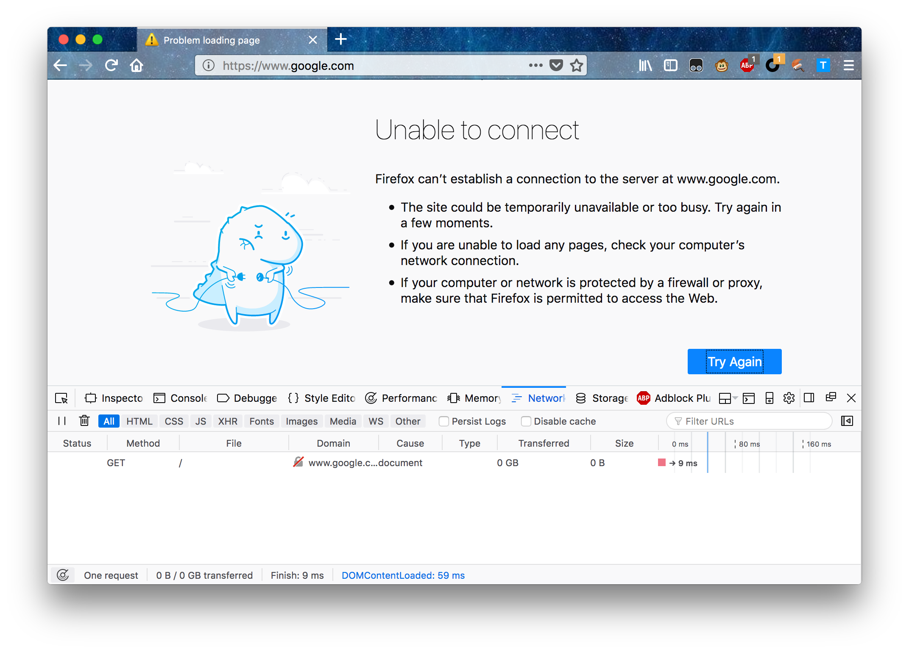
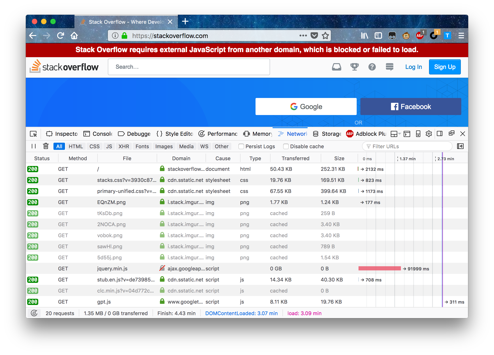

> 摘要：
> 如果加载某些网站龟速，可以试试安装 Gooreplacer 插件，然后 online-rules 中填入 `https://raw.githubusercontent.com/wkevin/configs/master/gooreplacer/gooreplacer.gson`。

作为一个程序员，肯定有用到 stackoverflow 的时候，长时间的等待才能加载出一个“丑陋”的网页…… No！这不是我们想要的。

读完本文，你将：

- 秒开大部分以前需要等待的网站
- 理解背后的原因
- 我为您推荐跨浏览器（ff、chrome、safari）的方便手段

我们在浏览器上敲入网址，回车后要经过很多步骤才能看到网页，其中有这样几步：

1. 找 DNS 服务器，将网址换算为 ip
2. 加载网页内容
   1. 加载网页核心内容
   2. 加载网页使用到的指定的 css、js、font…… —— 这些内容大都用 CDN 分发

# 为什么慢

## 原因 1：DNS 被墙

如果 DNS 被污染，ip 地址将不能被正确换算，打开这类网址是这个情况：

图中我打开了 ff 自带的调试工具（network，Ctrl+Alt+E），显示只有一行，然后没有了任何内容，如果科学上网之后，则是：

DNS 被污染或数据被截取重组等的情形，不是我要说的重点，如果撞墙了就科学上网，如果没被墙就等着修复。

## 原因 2：CDN 被墙

CDN--是一些网络服务商/运营商或大公司（Google、Facebook 等）提供的免费的资源分发服务，人家有钱有闲有追求，所以一般网站直接在人家服务器上使用这些资源即可。

这些网站自身没有被墙，因为用到的内容（css、js、font）下载链接在 Google 的 CDN 服务器上，所以被墙了，导致无法加载、加载慢。这些网站有：stackoverflow、askubuntu、pocket…… 通常是些向 google、facebook 等靠拢的科技型网站。

比如没有做任何手段的话，访问 stackoverflow 是这样的：

漫长的等待后（看上图中倒数第 4 行长长的一条红色，显示耗时 91999ms），因为在向 `ajax.googleapi.com` 要 jquery.min.js 脚本，撞墙。

这类情况即使最后也能显示出网页，功能也会有缺失，速度会显得奇慢无比，有些则完全加载不了。

本质上，这也是 DNS 被墙了，只不过是 CDN 服务器的 DNS 被墙了 —— 这个通常是有办法绕过去的。

# 如何加速

## 下策：屏蔽被墙的 CDN

加载不了的内容不加载它，显然可以加速整体网页的加载，常用的浏览器插件：**ABP**(adblock plus) block

比如吧 `ajax.googleapis.com` 屏蔽掉，可以如下操作：

- ABP -- Options -- Advanced -- My filter list（最下面） -- Edit Filters
- 加上： `||ajax.googleapis.com/ajax/libs/jquery/1.12.4/*`

但强调一下：如果是关键性的脚本，这种方式可能会造成网页的功能不完整。

## 上策：重定向工具

用一些重定向工具，把被墙的服务器地址重定向到国内可以的地址上，达到正常加载 CDN 内容的效果，才是正道。

这样的浏览器插件有好几个，推荐一个 ff、chrome、safari 通用的： **Gooreplacer**

- 安装：略
- 主要功能
  - 单条添加重定向规则、Cancel 规则（和 ABP 同理）、请求/应答数据包的包头。
  - Online-rules：添加在线的规则脚本，用正则表达式来定义重定向、Cancel、包头等过滤和处理规则。

话不多说，Online-rules 中添加我写好的规则吧：

`https://raw.githubusercontent.com/wkevin/configs/master/gooreplacer/gooreplacer.gson`

- 涵盖了 10+条 google、cloudflare、twitter、facebook 等被墙网站 CDN 的处理规则
- 至于我都是从哪里找的这些国内镜像 —— 哎，都是慢慢找、一点一点积累的，一根一根白头发换来的。
- 遇到新问题可以更新一下，说不定我已经添加进去了。
- 其中有一条要特别说明： `www.google.com/recaptcha/` 重定向到 `recaptcha.net/recaptcha/`
  - 这个 recaptcha 是 google 提供的真人识别、验证服务，比如出 9 幅图，让点击带火车的几幅
  - 我最爱的 Pocket 登录使用 recaptcha 验证，不重定向这个无法使用 Pocket 网页版

OK，科技类的网站基本可以不依赖 Google 了，可以自由、快速驰骋了。
