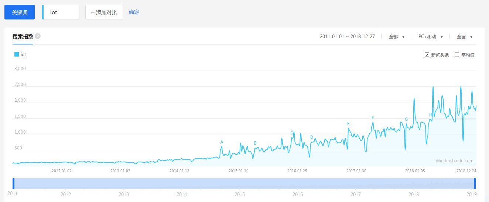

- [《Interconnecting Smart Objects with IP》](https://www.amazon.com/Interconnecting-Smart-Objects-IP-Internet/dp/0123751659): JP Vasseur, Adam Dunkels; 2010; 4.5 星
- [《基于 IP 的物联网架构技术与应用》](https://book.douban.com/subject/6722585/): 人民邮电；田辉（等众人）；2011.8；

Smart Object，译者翻译成 **智能物件**，见词知意，指物联网的终端设备、现在时髦点说 Edge 设备、尘设备、雾设备…… 2010 年那是还没有 IoT 这个词，物联网这个词也是刚刚兴起，所以在书中看不到 IoT、NB-IoT、LoRa……这些名词和技术。

但译者不厚道的是原书只是讲智能物件的，即：物联网终端，译者翻译成物联网架构 —— 我觉得这是故意的张冠李戴，恶意的曲解原意，只是为了书的销量。

一本老书，在当下飞速发展的物联网技术中，很多应该都过时了，我为啥要读它？—— 其实我是被作者 Adam Dunkels 吸引而已。

我在 10h 之前还不认识这个名字，但在 10 年前就用过 FreeRTOS+LwIP，还清晰的记得当年调试一块 LPC2468 的板子时被 LwIP 协议栈折磨的场景，3 个通宵好像是，才解决一个 bug。昨晚偶然下载到这本书，看到作者介绍说：Adam 就是 LwIP 的作者 —— 嘿！一种那啥见面，分外眼红的感觉。

[Adam 的 Wiki](https://en.wikipedia.org/wiki/Adam_Dunkels) 介绍他是瑞士的程序员和企业级，父母都是教授。从小喜欢嵌入式，先后写出了开源的 LwIP、uIP、Contiki……还是 IPSO（基于 IP 的 Smart Object） 联盟创始人。还有……他是 1978 年人，晕倒，同龄人，看人家都功成名就了。

怀着无比崇敬的心情，准备读一下此书。

**智能物件（SO）**这个词可能从来在中国没有流行起来，很少在各大杂志、展会、宣传中看到这个词汇，百度指数中也没有收录，而 IoT、物联网这类词汇则是连年增长的。

本书我用 4h 看完中文版的，我来总结一下**作者的想表达的重点**：

- SO 一定要用 IPv6，不用 IPv6 的都是耍流氓 —— 第 3、4、19 章
  - 不用 IP，用网关做协议转换的没前途，看 Zigbee 都撑不住转用 IP 了吧
  - 我不禁为 LoRa 捏了把汗，哈哈
- 对比了 3 个 SO 的 OS：TinyOS、Contiki、FreeRTOS —— 第 11 章
  - 当然是作者的 Contiki 全面胜出
- SO 的 PHY 和 MAC 层协议 —— 第 12、 16 章
  - IEEE802.15.4：基于它发展出的有：Zigbee、LoRa
  - IEEE802.11：基于它发展出的 WiFi
  - PLC：电力线通信
- SO 的 IP 层 —— 第 13、 15 章
  - 浓墨重彩的介绍了作者自己的 uIP
    - 2001.9 发布 V1，与 Contiki 同步
    - 支持 3 种传输层协议： ICMP、TCP、UDP
    - ​ 路由和转发分离
    - ​ 摒弃多线程 SockertAPI，使用事件驱动的 API
    - ​ 不支持多个数据包的同时重组
    - ​ 不使用滑窗，不缓存已发送的数据包
    - ​ 基本不实现流量控制、去掉拥塞控制
    - 特色挺多，裁剪的厉害，有兴趣的看原书吧
- SO 中的用的路由协议 RPL —— 第 5、17 章
  - 第 17 章 ​34 页，是全书最长、最复杂、最有技术难度的一章
  - 这估计也是作者实现 uIP 时遇到的最棘手的技术难题吧
- 服务发现和 WebService —— 第 7、9 章
  - 这是物联网的重点，即提供的局域网服务、和云端服务
  - 嵌入式量大，但不和普通用户直接耦合，工程师搞定机器容易
  - 云端服务需要搞定各种业务需求，难！
  - 书中介绍了一个云端系统：Pachube，大概介绍一下这个平台：
    - ​2007 年英国建筑师 UsmanHaque 创建，命名 Pachube
    - ​2011.3，福岛核事故发挥作用，名声大噪
    - ​2011.7，LogMeIn 收购更名 Cosm
    - ​2013.5，更名 Xively，意为互联（X）的 生活（lively）
    - 2016，淡出物联网界
    - 2018.2 Google 接盘
  - 2010 年写书时，正式 Pachube 蒸蒸日上的时候，10 年之后，物是人非
- 组织和协会 —— 第 14、18 章
  - IETF 个人组织
    - 1986 成立，信条是：**​ 我们反对国王、总统以及选举，我们信奉非共识以及运行代码**
    - 2004 年成立了一个工作组： **6LoPWAN**（IPv6 Lower Power WAN）
    - 2008 年成立了一个工作组： **ROLL**
  - IPSO 联盟
    - 2008.9 Cisco 等 10+公司联合创立，Adam 也是创立人之一
    - 主要任务是撰写白皮书，大多是对 IETF 文档的解释
- 遗憾的是完全没有介绍作者的 OS： Contiki

总结完毕，书是好书，值得一看，只不过大部分内容要当历史书看。

最后放几个链接：

- Adam Dunkels 的 [Github](https://github.com/adamdunkels) —— 已经多年不提交了
  - uIP 的[源码](https://github.com/adamdunkels/uip) —— 已经 6 年没更新了
- Contiki 社区的 [github](https://github.com/contiki-os) —— 活跃中
  - Contiki 的[源码](https://github.com/contiki-os/contiki)
