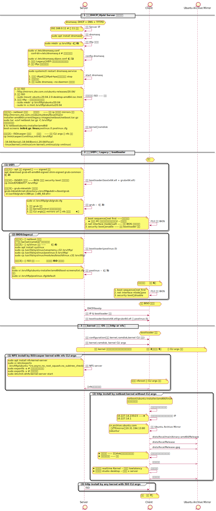

本文描述了如何用一台 Linux 做 Server，通过一根网线为另一台电脑（Client）安装 Linux（Ubunt），时序图可以完整的展示每个步骤操作的环境、顺序、关键点。



<!--truncate-->

### 注 0

之所以使用 /srv/tftp，因为 grub 推荐 grub-mknetdir 命令来创建网络启动 grub：

```
grub-mknetdir --net-directory=/srv/tftp --subdir=/boot/grub -d /usr/lib/grub/i386-pc
```

参考：[8 Booting GRUB from the network](https://www.gnu.org/software/grub/manual/grub/grub.html#Network)

### 注 1

```

interface=\* # 有些文档说写网卡名，如 enp4s0，但有些文档说无效，我实测不行
bind-interfaces
dhcp-range=192.168.0.100,192.168.0.200,12h

# BIOS(Legacy) 方式从 pxelinux.0 开始

# dhcp-boot=pxelinux.0

# UEFI 方式从 bootx64.efi klui

dhcp-match=set:efi-x86_64,option:client-arch,7
dhcp-boot=tag:efi-x86_64,bootx64.efi

# 使能 tftp，并配置根路径

enable-tftp
tftp-root=/srv/tftp

```

### 注 2

```
dpkg-deb --fsys-tarfile grub-efi-amd64-signed*deb | tar x ./usr/lib/grub/x86_64-efi-signed/grubnetx64.efi.signed -O > grubx64.efi
dpkg-deb --fsys-tarfile shim-signed*deb | tar x ./usr/lib/shim/shimx64.efi.signed -O > bootx64.efi
dpkg-deb --fsys-tarfile grub-common\*deb | tar x ./usr/share/grub/unicode.pf2 -O > unicode.pf2
sudo mv grubx64.efi bootx64.efi unicode.pf2 /srv/tftp/
```

### 注 3 - 配置 grub

- [grub2 doc](https://www.gnu.org/software/grub/manual/grub/)
  - 16.3 The list of command-line and menu entry commands 章节有完整的命令列表

配置中最关键的是这几行:

```
menuentry ... {
gfxpayload=keep
linux /vmlinuz
initrd /initrd
}
```

- menuentry 是菜单选择
- 可以接受的命令有几十个，包括:
  - `gfxpayload=keep` video mode，替代以前 32 位 x86 中的 `vga=...`
  - `linux kernel-image args...` load kernel, args 会传递给 kernel

**最佳实践：**

```

set default="0"
set timeout=-1

if loadfont unicode ; then
set gfxmode=auto
set locale_dir=$prefix/locale
set lang=en_US
fi
terminal_output gfxterm

set menu_color_normal=white/black
set menu_color_highlight=black/light-gray
if background_color 44,0,30; then
clear
fi

function gfxmode {
set gfxpayload="${1}"
        if [ "${1}" = "keep" ]; then
set vt_handoff=vt.handoff=7
else
set vt_handoff=
fi
}

set linux_gfx_mode=keep

export linux_gfx_mode

menuentry 'nfs by iso-casper kernel' {
        gfxmode $linux_gfx_mode
        linux /ubuntu/20.04/casper/vmlinuz boot=casper only-ubiquity local-zh_CN splash audit=0 ip=dhcp netboot=nfs nfsroot=192.168.0.11:/var/lib/tftp/ubuntu/20.04 rw
        initrd /ubuntu/20.04/casper/initrd
}
menuentry 'http by netboot kernel' {
        gfxmode $linux_gfx_mode
        linux /netboot/ubuntu-installer/amd64/linux
        initrd /netboot/ubuntu-installer/amd64/initrd.gz
}
```

### 注 4

Syslinux 是一个 Project，包含以下 bootloader：

1. SYSLINUX, for MS-DOS FAT filesystems
2. PXELINUX, for network booting
3. ISOLINUX, for bootable "El Torito" CD-ROMs
4. EXTLINUX, for Linux ext2/ext3/ext4 or btrfs filesystems
5. MEMDISK, for legacy operating systems (such as DOS) from nontraditional media

### 注 5 - 配置 pxelinux.0

这里可以控制 pxelinux 从多个地方加载安装包。

**最佳实践：**

- **从网络直接下载 ISO**

```
DEFAULT install
LABEL install
KERNEL vmlinuz
INITRD initrd
APPEND root=/dev/ram0 ramdisk_size=1500000 ip=dhcp url=http://...iso
```

- **从 nfs server 下载**

1. 当 vmlinuz（压缩版）、initrd 从 ISO/casper 中提取时：

```
kernel ubuntu/18.04/casper/vmlinuz
append vga=788 boot=casper netboot=nfs nfsroot=192.168.1.10:/srv/tftp/ubuntu/18.04 initrd=ubuntu/18.04/casper/initrd --- quiet splash
```

2. 当 linux（未压缩）、initrd.gz（压缩）从 [netboot](http://mirrors.zte.com.cn/ubuntu/dists/[xenial|bionic|focal]/main/installer-[amd64|i386]/current/images/netboot/netboot.tar.gz) 中提取：

```
kernel netboot/ubuntu-installer/amd64/linux
append vga=788 netboot=nfs nfsroot=192.168.1.10:/srv/tftp/ubuntu initrd=netboot/ubuntu-installer/amd64/initrd.gz --- quiet
```

其中：

- 必要时请执行 `sudo ln -s /mnt/ /srv/tftp/ubuntu`
- **splash** ：表示 loading 屏幕是否显示，禁用的话 loading 时一片空白

### 注 6

由于 pxelinux 对扩展显卡支持不完备：

1. 使用集成显卡，扩展显卡会异常黑屏、蓝屏、粉屏……
2. 使用小尺寸的显示器，pxelinux 大显示器支持不完备（字体、图标过大……）

### 注 7

- 安装完毕后，网卡不能使用
  - NetworkManager 中找不到网卡
    - 原因：NetworkManager 没有使能
    - 解决
      - `sudo vi /tc/NetworkManager/NetworkManager.conf` 增加 `managed=true` —— 使能 NM
      - `sudo service NetworkManager stop`
      - `sudo rm /var/lib/NetworkManager/NetworkManager.state`
      - `sudo service NetworkManager start`
