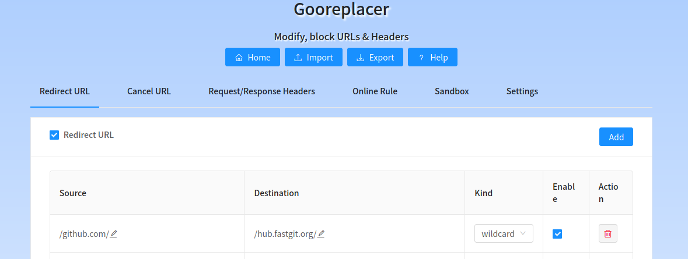

国内经常无法顺畅的连接 github，各类 git 操作都无法进行，但其实已经有团队做了 github 镜像站，比如下面要介绍的 2 个。

<!--truncate-->

## 1. [https://hub.fastgit.org](https://hub.fastgit.org)

这个[团队](https://fastgit.org/)应该是国内的小伙伴，但把网站建在了 UK，肉身不知道在哪，反正当前能用。

登录 [网站](https://hub.fastgit.org) 就可以看到 github 上同步镜像过来的内容，偶尔 404，过几分钟刷新一下网页即可。

拉取代码操作 `git clone https://github.com/xxx/yyy` 就可以用 `git clone https://hub.fastgit.org/xxx/yyy` 代替。

如果你觉得这样让本地库的 git remote 变成了 fastgit，总觉得有点别扭，还想继续使用 github.com 做 remote 的话，可以使用 [git 的 insteadOf 功能](https://git-scm.com/docs/git-push/2.6.7#_git_urls)，即：

```sh
git config --global url."https://hub.fastgit.org/".insteadOf "https://github.com/"
git config protocol.https.allow always
```

这样，就可以继续使用 `git clone https://github.com/xxx/yyy` 来拉取项目，并且后面的 push、pull 操作都会被自动替换网址。

问题也是有几个的：

- 失败的话需要重来，跟网页 404 多次刷新一样，fastgit 做了防滥用阻止 IP 的设置。
- 不支持 ssh，这样的话只能在网页输入 name 和 password 了，是否能够保障密码安全，参考 [他们团队的隐私说明](https://doc.fastgit.org/zh-cn/privacy.html)。

该团队还做了一些工具，油猴脚本，帮助在浏览器上完成无感替换。

该团队还对 github 的 raw、download、archive 都做了镜像，具体代理列表[在这里](https://doc.fastgit.org/zh-cn/node.html)。

## 2. [https://github.com.cnpmjs.org](https://github.com.cnpmjs.org)

阿里的中国 NPM 镜像 [cnpm](https://npmmirror.com/) 也做了同样的事情，只是在官网上没有列出来，比较低调，原理同上，简单列举：

- 网址镜像：[https://github.com.cnpmjs.org](https://github.com.cnpmjs.org)
- 拉取替换：`git clone https://github.com.cnpmjs.org/xxx/yyy`
- 默认替换：`git config --global url."https://github.com.cnpmjs.org/".insteadOf "https://github.com/"`

## 浏览器替换插件

再配合浏览器网址替换插件，如 Gooreplacer（[firefox](https://addons.mozilla.org/en-US/firefox/addon/gooreplacer/)、[chrome](https://chrome.google.com/webstore/detail/gooreplacer/jnlkjeecojckkigmchmfoigphmgkgbip)），做一个网址替换，还可以更方便一些，如下图：


