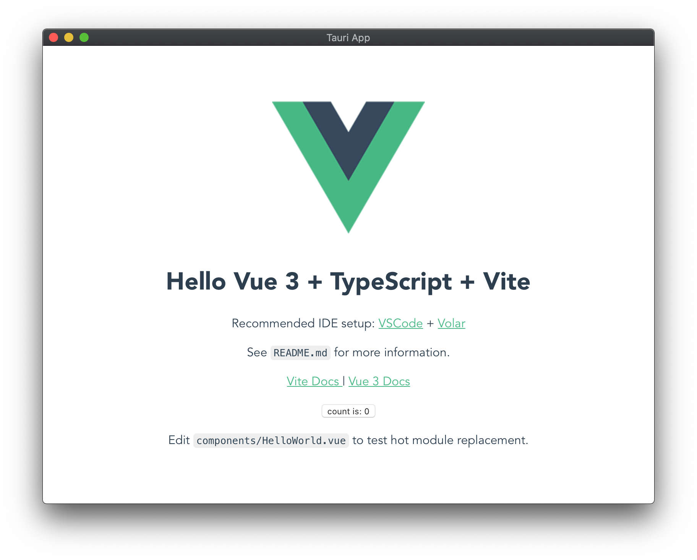

一直想用前后端技术栈做个跨平台（Win/Linux/macOS）的 APP，前几年了解过 Electron，到后来始终没有应用场景，就放下了，最近又掌握了一下最新情况：

| 框架     | 前端                       | 后端       |
| -------- | -------------------------- | ---------- |
| Electron | Angular/VUE/React          | typescript |
| Wails    | VUE/React                  | go         |
| Goxygen  | Angular/VUE/React          | go         |
| Tauri    | Angular/VUE/React/Vite/... | rust       |

前几天恰逢有个场景，就试了一下 [Tauri](https://tauri.studio/)，相比 Electron, Tauri 不会把 node 和 chromium 打包到最终 APP，所以最终构建出的版本会小很多，运行速度也快很多。

用了 2 天跑起来了一个基本的 APP，前端 `Vite + VUE4 + Element-plus + TypeScript`，后端 Rust，过程记录如下。

<!--truncate-->

### 脚手架创建项目

#### npm/yarn 准备

如果不是在公司 Proxy 之后，则忽略本段，设置好淘宝的 npm 镜像即可，我是在公司 Proxy 之后折腾的，并且 yarn 与 npm 还有一些差异，所以特别记录一下。

因为早期(`<1.0.0-beta8`)的 tauri 在运行脚手架时需要从 github 上下载东西，所以我需要处理同时：“通过 proxy 访问 github” + “公司内包服务器下载 npm 包”的情形。

> 注：1.0.0-rc 后就不需要从 github 上下载了，一下轻松很多。

| npm 配置项 | npm                                  | yarn                  |
| ---------- | ------------------------------------ | --------------------- |
| `registry` | `npm config set registry <包服务器>` | 使用 npm 的           |
| `proxy`    | `npm config set proxy <代理服务器>`  | 使用 npm 的           |
| `noproxy`  | `npm config set noproxy <包服务器>`  | **不使用 npm 此配置** |

[npm 的 config 详细文档](https://docs.npmjs.com/cli/v8/using-npm/config) 中有 registry、proxy、noproxy 等所有配置项的说明。

另外，对于 shell 环境变量，npm 和 yarn 也不同处理

| shell 变量                     | npm    | yarn   |
| ------------------------------ | ------ | ------ |
| `http-proxy`<br/>`https-proxy` | 不使用 | 使用   |
| `no_proxy`                     | 不使用 | 不使用 |
| `npm_config_xxx`               | 接受   | 不接受 |

因此，总结一下在公司内网安装的最佳方案：

| 目的                | `proxy`                   | `noproxy`          |
| ------------------- | ------------------------- | ------------------ |
| 内网包服务器 + npm  | 可以配，别配错就行        | 可以配，别配错就行 |
| 内网包服务器 + yarn | `npm config delete proxy` | 无效               |
| 外网包服务器 + npm  | 必须正确配置              | 必须正确配置       |
| 外网包服务器 + yarn | 使用 npm 配置             | 无效               |

配置好后检查一下

```sh
$ npm update
$ npm config list
$ yarn config list
```

#### Create

下面是 yarn 和 npx 两种用脚手架的方式对比，运行阶段是相同的，整体来说 yarn 的成功率会高一些，反复安装的速度也大幅提升。所以直连外网的话必须首选 yarn，内网安装的话就是面对上面 3 号环境，用 npm 更合适些。

- yarn: `yarn create tauri-app`
- npm: `npx create-tauri-app`

| 阶段                                                     | 说明                                                   | yarn            | npm                 |
| -------------------------------------------------------- | ------------------------------------------------------ | --------------- | ------------------- |
| 准备脚手架                                               | Install create-tauri-app@1.0.0-beta.4                  | 正常            | 正常                |
| 交互式配置                                               | app name/title/UI reciped 等                           | 正常            | 正常                |
| `>>Running initial command(s)`                           | 安装 create-vite                                       | 正常            | 正常                |
| `>> Installing any additional`<br/>`needed dependencies` | 安装 vue,vite,ts,tauri-apps/cli 直接包及其 370+ 依赖包 | 优秀<br/>[注 1] | 偶发失败<br/>[注 2] |
| `>> Updating "package.json"`                             | 将项目配置写入 package.json                            | 正常            | 正常                |
| `>> Running "tauri init"`                                | 先 Download Rust CLI [注 3]，然后执行初始化[注 4]      | 一次下载        | 反复下载            |
| `>> Updating "tauri.conf.json"`                          |                                                        |                 |                     |
| `>> Running final command(s)`                            | `vue-tsc --noEmit && vite build`                       |                 |                     |

注：

1. yarn 下载的包会缓存在 `yarn cache dir` 目录下面，然后在项目目录下的 node_modules 下创建软连接，所以重复安装时会非常快速，并节省硬盘空间。
2. 多次出现安装不完整的情况，以至于后面使用 esbuild 包总是找不到，其实 esbuild 是 vite 所依赖的，安装 vite 时应该装上。
3. Downloading Rust CLI 下载的是 rust 版本的 tauri-cli，会把这个命令放在 `node_modules/@tauri-apps/cli/bin/` 下面，是从 github 上下载的，准备好科学上网，一旦成功最好保存好。但 yarn 就放心吧，以后用的都是软连接，不会再重复下载了。
4. `$ tauri init --app-name demo --window-title demo --dist-dir ../dist --dev-path http://localhost:3000 --ci` 会创建 src-tauri 文件夹。

### 项目运行

项目创建成功后，就可以直接运行，顺利的话就直接看到 VUE 的界面了：

- yarn: `yarn tauri dev`
- npm: `npm run tauri dev`

过程有这么几步：

1. `tauri-cli tauri dev`: 执行 rust 命令 tauri-cli
2. 使用 vite 编译和打包 vue 前端，server：http://localhost:3000/
3. 下载必要的 rust 依赖包，并编译，这个规模还挺大，截图看一下：

```sh
  ......
       Fetch [=================>       ]  73.50%, (65264/114324) resolving deltas
  ......
  Downloaded cfg_aliases v0.1.1 (registry `sjtu`)
  Downloaded chrono v0.4.19 (registry `sjtu`)
  Downloaded cocoa v0.24.0 (registry `sjtu`)
  Downloaded cocoa-foundation v0.1.0 (registry `sjtu`)
  Downloaded bstr v0.2.17 (registry `sjtu`)
  Downloaded constant_time_eq v0.1.5 (registry `sjtu`)
  Downloaded 213 crates (9.8 MB) in 16.11s
   Compiling libc v0.2.113
   Compiling cfg-if v1.0.0
   Compiling proc-macro2 v1.0.36
   Compiling unicode-xid v0.2.2
   Compiling syn v1.0.86
```

一切顺利的话，就能看到封装成 APP 的 VUE 了：



### 补充

顺利运行了 1 天，突然在 `npm run tauri dev` 的第 1 步报错：

```sh
Error: failed to get project out directory

Caused by:
0: failed to parse cargo config file
1: newline in string found at line 12 column 33
```

我以为是 `src-tauri/` 下的 Cargo.toml 或 tauri.conf.json 被我修改坏了，反复修改也不行，后来琢磨出来可能不是，去看了一眼 `~/.cargo/config`，原来被我改坏了，哎！

### 补充 2

2022 年 2 月，tauri 从 beta 升级到 1.0.0-rc.1，Download Rust CLI 步骤不再从 github 上下载二进制版本，所以不需要连外网了，进而都首选 yarn 了。
