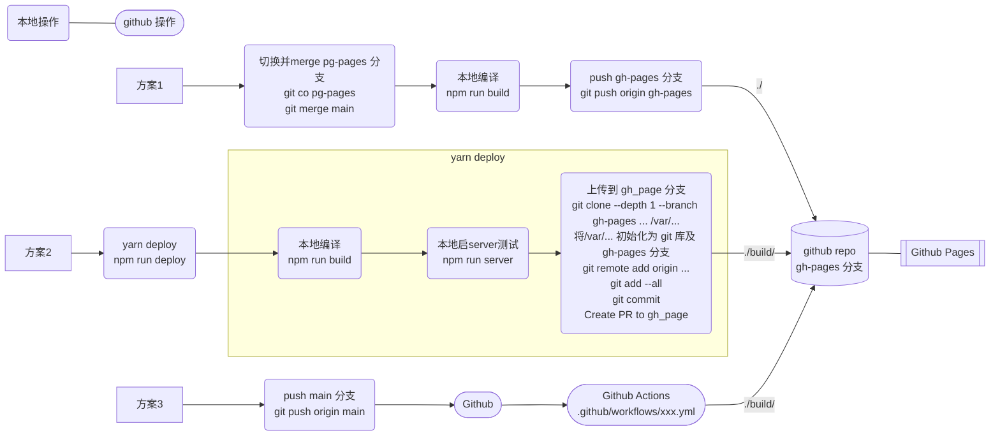

今天把 Blog 从 Jekyll 转到 Docusaurus 了，仍是部署到 github，部署过程记录一下。

部署大体可以有这么几种方案：

<!--truncate-->

方案 1：本地编译 gh-pages 分支，并上传，Github Pages 配置到 gh-pages 分支的 `build/` 目录上。

方案 2：使用 `yarn deploy` 整合命令，自动上传到 gh-pages 分支上，该分支仅包含 build 下内容，所以 Github Pages 配置到 gh-pages 分支的 `/` 根目录。

方案 3：使用 Github Actions（或类似 Travis CI 竞品），需要写 Actions 的 workflow 和 job，Docusaurus 已经[写好了一份](https://docusaurus.io/docs/deployment#triggering-deployment-with-github-actions)，复制到 `.github/workflows/` 即可。

官方写了 2 个 workflow 的例子：

- `.github/workflows/test-deploy.yml`：指定分支有 PR 时触发，仅测试能否 build 成功。
- `.github/workflows/deploy.yml`：指定分支 push 时触发，表示 PR 已经被 review 通过，执行 build、和另一个 Github Action，用通用账号部署到个人的 repo 中的指定分支（一般就是 gh-pages）中。

方案 1 全手工没必要，方案 2 要废自己电脑的算力来 build，推荐方案 3，免费撸 MS 的羊毛，如果每次 pull 的时候只拉取 main 分支 `git pull origin main`，不拉取 gh-pages 分支，那样连本机磁盘都不占用了。
