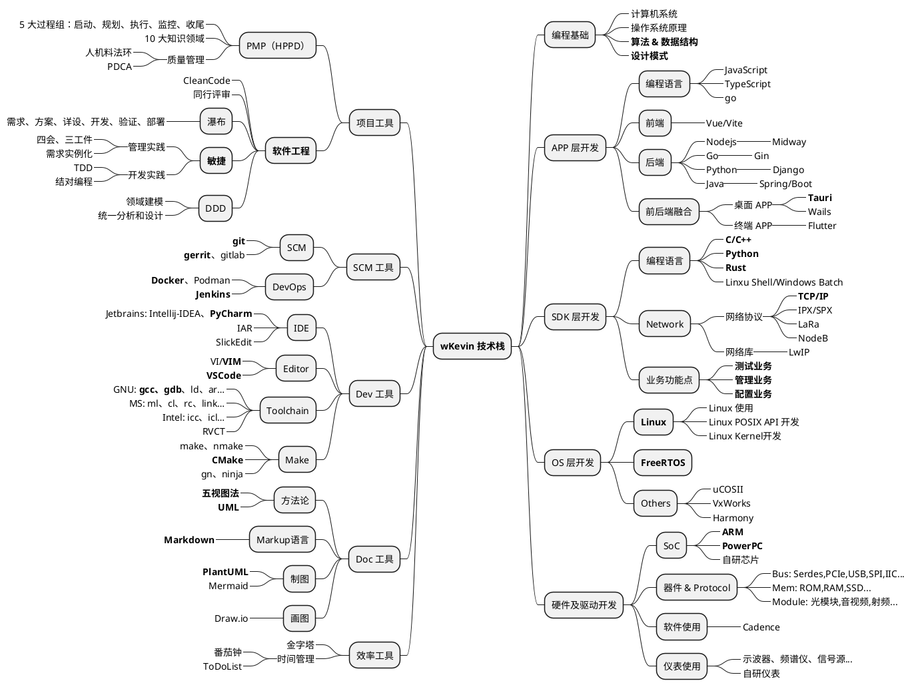

工欲善其事（右侧），必先利其器（左侧）。

```plantuml
@startmindmap

+ **wKevin 技术栈**

++ 编程基础
+++_ 计算机系统
+++_ 操作系统原理
+++_ **算法 & 数据结构**
+++_ **设计模式**

++ APP 层开发
+++ 编程语言
++++_ JavaScript
++++_ TypeScript
++++_ go
+++ 前端
++++_ Vue/Vite
+++ 后端
++++_ Nodejs
+++++_ Midway
++++_ Go
+++++_ Gin
++++_ Python
+++++_ Django
++++_ Java
+++++_ Spring/Boot
+++ 前后端融合
++++_ 桌面 APP
+++++_ **Tauri**
+++++_ Wails
++++_ 终端 APP
+++++_ Flutter

++ SDK 层开发
+++ 编程语言
++++_ **C/C++**
++++_ **Python**
++++_ **Rust**
++++_ Linxu Shell/Windows Batch
+++ Network
++++_ 网络协议
+++++_ **TCP/IP**
+++++_ IPX/SPX
+++++_ LaRa
+++++_ NodeB
++++_ 网络库
+++++_ LwIP
+++ 业务功能点
++++_ **测试业务**
++++_ **管理业务**
++++_ **配置业务**

++ OS 层开发
+++ **Linux**
++++_ Linux 使用
++++_ Linux POSIX API 开发
++++_ Linux Kernel开发
+++ **FreeRTOS**
+++ Others
++++_ uCOSII
++++_ VxWorks
++++_ Harmony


++ 硬件及驱动开发
+++ SoC
++++_ **ARM**
++++_ **PowerPC**
++++_ 自研芯片
+++ 器件 & Protocol
++++_ Bus: Serdes,PCIe,USB,SPI,IIC...
++++_ Mem: ROM,RAM,SSD...
++++_ Module: 光模块,音视频,射频...
+++ 软件使用
++++_ Cadence
+++ 仪表使用
++++_ 示波器、频谱仪、信号源...
++++_ 自研仪表


-- 项目工具
--- PMP（HPPD）
----_ 5 大过程组：启动、规划、执行、监控、收尾
----_ 10 大知识领域
----_ 质量管理
-----_ 人机料法环
-----_ PDCA
--- **软件工程**
----_ CleanCode
----_ 同行评审
---- 瀑布
-----_ 需求、方案、详设、开发、验证、部署
---- **敏捷**
-----_ 管理实践
------_ 四会、三工件
------_ 需求实例化
-----_ 开发实践
------_ TDD
------_ 结对编程
---- DDD
-----_ 领域建模
-----_ 统一分析和设计

-- SCM 工具
--- SCM
----_ **git**
----_ **gerrit**、gitlab
--- DevOps
----_ **Docker**、Podman
----_ **Jenkins**

-- Dev 工具
--- IDE
----_ Jetbrains: Intellij-IDEA、**PyCharm**
----_ IAR
----_ SlickEdit
--- Editor
----_ VI/**VIM**
----_ **VSCode**
--- Toolchain
----_ GNU: **gcc、gdb**、ld、ar…
----_ MS: ml、cl、rc、link…
----_ Intel: icc、icl…
----_ RVCT
--- Make
----_ make、nmake
----_ **CMake**
----_ gn、ninja

-- Doc 工具
--- 方法论
----_ **五视图法**
----_ **UML**
--- Markup语言
----_ **Markdown**
--- 制图
----_ **PlantUML**
----_ Mermaid
--- 画图
----_ Draw.io

-- 效率工具
---_ 金字塔
---_ 时间管理
----_ 番茄钟
----_ ToDoList
@endmindmap
```
